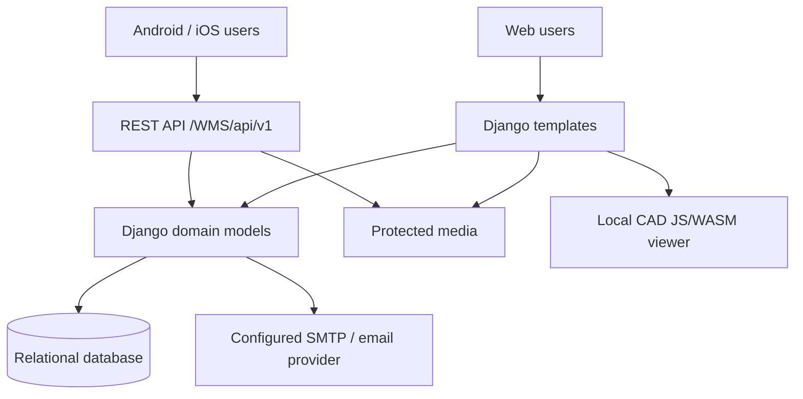

# Architecture

## System context

## Backend

- Django 5.2 application with the historical domain in `MyApp`.
- Template views remain session-authenticated.
- Mobile endpoints are isolated in `MyApp/api` and versioned below `/WMS/api/v1/`.
- Legacy session middleware deliberately bypasses `/WMS/api/`; Django REST Framework handles API authentication.
- Project access is calculated from role and allocation tables on every request. The client never determines authorization.
- Existing table and template contracts remain intact.
- Quotation transitions and notification/email side effects are performed in transactional workflow handlers. Draft visibility is enforced server-side, not by template/API filtering alone.
- Client submission uses the configured SMTP backend and attaches the generated PDF; credentials are supplied through environment/secret management, never source control.

## Mobile

- Expo SDK 57, React Native, Hermes-compatible JavaScript, strict TypeScript.
- React Navigation native stack and bottom tabs.
- `expo-secure-store` stores the bearer token; passwords are never persisted.
- A central client adds authorization and normalizes errors.
- Auth context restores/revokes the session at launch.
- Shared UI uses the established WMS palette: `#4154f1`, `#012970`, `#f6f9ff`.
- `EXPO_PUBLIC_API_URL` is the only environment-specific mobile setting.

## Authentication

1. Client submits username/password over HTTPS. Legacy email-based usernames remain accepted during transition.
2. Server verifies the Django password hash and returns a timestamped signed token containing account ID and token version.
3. SecureStore uses Android Keystore or iOS Keychain storage.
4. Every request validates signature, age, account, and token version.
5. Logout or password change increments `api_token_version`, revoking existing tokens.

Default lifetime is 30 days. Configure seconds with `WMS_MOBILE_TOKEN_MAX_AGE`.

## Compatibility rules

- Mobile work uses new routes and one additive account field.
- Template URL names and behavior are preserved.
- Workflow transitions mirror `workflow_views.py` state checks.
- Multi-record writes are transactional.
- Project access uses existing allocation tables.

## Modernization boundary

Historical dates, quantities, and money fields are sometimes strings. The API preserves those values to avoid breaking data. A future schema conversion requires staged data migration, validation, backup, and a separate release plan.
