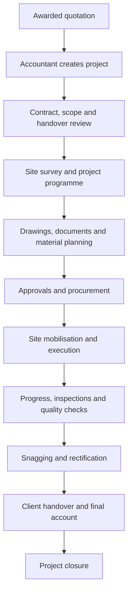

# Product and Workflow Guide

## What WMS is

WMS is a construction and fit-out work management system. It joins pre-sales enquiries, quotation and costing approval, project setup, planning, site execution, material control, accounting, documents, and project communication in one role-controlled application.

The web application is the complete administrative interface. WMS Mobile is the focused operational client for employees who need project information, approvals, communication, and site reporting away from a desk.

## Roles

| Role | Primary responsibilities |
|---|---|
| Admin | Staff administration, operational allocations, reporting and application administration |
| Marketing Executive | Create enquiries, attach files, comment, submit approved quotations to clients, record client acceptance |
| Marketing Manager | Create/review enquiries, assign estimators, first quotation approval, request revision, submit and award approved quotations |
| Estimator | Assigned enquiries, private quotation drafts, quotation versions, costing, submit-for-approval |
| Project Manager | Allocated projects, scope/materials/schedules, costing and material-request approval |
| Accountant | Final quotation approval, project creation, project payments and accounting |
| Document Controller | Verify project documents and release approved quotations to clients |
| Supervisor | Site progress, workers, usage, requests, photos |
| Purchaser | Allocated projects, demand, deliveries, material issue status |

Project Managers, Supervisors, and Purchasers only see projects assigned through their allocation records. Authorization is enforced by the server.

## Enquiry-to-project workflow

```mermaid
flowchart LR
  E["Marketing creates enquiry"] --> A["Manager assigns estimator"]
  A --> Q["Estimator saves private draft"]
  Q --> F["Estimator submits for approval"]
  F --> M["Marketing Manager approval"]
  M --> C["Accountant approval"]
  M -->|Revision request| Q
  C -->|Revision request| Q
  C --> S["Authorised user submits to client"]
  S --> U["Client status: Under Review"]
  U --> W["Marketing Executive/Manager records Awarded"]
  W --> R["Accountant creates project and transfers documents"]
  R --> P[\"System assigns the Project Manager (auto-assign if single PM exists, future: OM selects if multiple exist)\"]
```

Enquiry states are `open → assigned → quoted → approved → submitted → awarded`. `closed` is terminal for an enquiry that does not proceed. A draft is not `quoted`: the enquiry becomes `Quotation Prepared` only when the estimator submits the quotation for approval. Accountant approval makes the quotation client-ready; Project Manager costing approval is an independent project-control step and is not a prerequisite for client submission. A successful submission sends the generated PDF by email and sets client status to `Under Review`; Marketing Executive or Marketing Manager can then mark it `Awarded` (`Approved`). Awarded quotations are final and cannot be revised or have their client status changed.

Draft quotations remain private to their estimator. Other roles cannot view, download, discuss, or approve a draft until it is submitted for approval. Manager and Accountant revision requests before final approval return the quotation to draft, clear the relevant approvals, and notify the estimator. A client revision request after submission sets the quotation to `Under Revision`; the estimator starts the new revision from the quotation view, not from enquiry history.

## Project execution

1. Accountant creates the project. The awarded enquiry, quotation history and collected documents remain linked/transferred, and the system assigns the Project Manager automatically (if exactly one exists) or the Operation Manager will assign one from available Project Managers (when multiple exist).
2. Project Manager defines scope, required materials, and schedules. Lists support bulk entry and copying from another project.
3. Supervisor reports workers, usage, progress, site photos, and requests.
4. Project Manager approves or rejects pending material requests.
5. Purchaser records deliveries and material issue progress.
6. The project team communicates through project chat.
7. Accounting records payments and transactions.
8. Operational and commercial closeout precedes completed status.

### Updated project-control workflow

The project lifecycle is now managed as a sequence of control gates. The Project Manager owns the overall result; each specialist owns the records and actions assigned to their role.



#### Control gates and ownership

| Gate | Primary owner | Supporting roles | Current WMS controls |
|---|---|---|---|
| Project registration and handover | Accountant | PM, Estimator, Marketing | Awarded quotation transfer, project master, automatic PM assignment when one PM exists |
| Contract and scope review | Project Manager | Engineer, Estimator, Accountant | Scope of work, estimate, project documents |
| Programme and planning | Project Manager | Engineer, Supervisor, Foreman | Work schedule, start/finish dates, progress tracking |
| Technical/document control | Project Engineer / Document Controller | PM, Purchaser | Drawings, uploaded documents, quotation/project document history |
| Materials and procurement | Purchaser | PM, Engineer, Supervisor | Material list, material requests, issued materials, delivery records |
| Site execution | Supervisor / Foreman | Engineer, PM | Work progress, worker reports, site photos, project chat |
| Inspection and quality | Project Engineer | Supervisor, Document Controller | Inspection records and status tracking |
| Commercial control | Estimator / Accountant | PM | Estimate, project value, payments, outstanding balance |
| Handover and closure | Project Manager | Engineer, Document Controller, Accountant | Completion status, documents, payment and operational closeout |

#### Operational rules

- Every project action must be associated with a project, an owner, a status and (where applicable) a due date.
- Only the current approved drawing or document revision should be used for execution. Superseded records remain available as history.
- Material requests remain pending until an authorised project role approves, rejects or closes them.
- Progress is calculated from recorded work-progress entries; schedule items that pass their planned date without completion are shown as overdue.
- Project health is derived consistently across dashboards: `Completed`, `Delayed`, `At Risk`, or `On Track`.
- Project dashboards show progress, handover timing, pending materials, overdue schedule activities, documents, project value, received payments and outstanding balance.
- The Project Manager workspace is the operational hub. The Accountant has a consolidated project and financial view, while allocated operational roles remain restricted to their assigned projects.

#### Dashboard interpretation

The portfolio dashboard is intentionally action-oriented:

- **Active projects**: all non-completed projects in the current portfolio.
- **On track**: active projects without overdue work or immediate material/schedule risk.
- **At risk**: projects with pending materials or handover within the configured warning window.
- **Delayed**: projects with overdue schedule activities that are not completed.
- **Outstanding**: project value less recorded payments, never below zero.
- **Document count**: project documents, drawings and transferred project documents currently linked to the project.

The same calculations are used in the Accountant register, Accountant project view and Project Manager dashboard so that a project does not display contradictory health or progress values in different screens.

#### Planned control-register expansion

The current application already provides the project, schedule, materials, documents, drawings, inspections, payments, progress, photos and communication controls listed above. The full business workflow also calls for dedicated registers for RFIs, material submittals, MIR/WIR approvals, correspondence, variations, meeting minutes, tasks, snags and handover checklists. These should be added as separate audited records with owner, due date, status, comments, attachments and notification history; they should not be overloaded into the existing generic document or remarks fields. The database change must be delivered through the project's SQL/Flyway process before those modules are enabled in production.

## Mobile navigation

- **Home:** role metrics and recent projects.
- **Projects:** allocated/searchable portfolio, planning and operational details.
- **Workflow:** enquiry, quotation, costing, and approvals for eligible roles.
- **Alerts:** employee notifications and read state.
- **Profile:** account, server connection, password, and sign-out.

## CAD

DWG and DXF attachments are rendered locally in the web CAD viewer after authorization. Mobile identifies CAD attachments and directs detailed drawing inspection to that full viewer.
