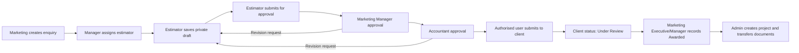

# Product and Workflow Guide

## What WMS is

WMS is a construction and fit-out work management system. It joins pre-sales enquiries, quotation and costing approval, project setup, planning, site execution, material control, accounting, documents, and project communication in one role-controlled application.

The web application is the complete administrative interface. WMS Mobile is the focused operational client for employees who need project information, approvals, communication, and site reporting away from a desk.

## Roles

| Role | Primary responsibilities |
|---|---|
| Admin | Staff/project administration, allocations, reporting, project creation, document transfer |
| Marketing Executive | Create enquiries, attach files, comment, submit approved quotations to clients, record client acceptance |
| Marketing Manager | Create/review enquiries, assign estimators, first quotation approval, request revision, submit and award approved quotations |
| Estimator | Assigned enquiries, private quotation drafts, quotation versions, costing, submit-for-approval |
| Project Manager | Allocated projects, scope/materials/schedules, costing and material-request approval |
| Accountant | Final quotation approval, project payments, accounting |
| Document Controller | Verify project documents and release approved quotations to clients |
| Supervisor | Site progress, workers, usage, requests, photos |
| Purchaser | Allocated projects, demand, deliveries, material issue status |

Project Managers, Supervisors, and Purchasers only see projects assigned through their allocation records. Authorization is enforced by the server.

## Enquiry-to-project workflow

Enquiry states are `open → assigned → quoted → approved → submitted → awarded`. `closed` is terminal for an enquiry that does not proceed. A draft is not `quoted`: the enquiry becomes `Quotation Prepared` only when the estimator submits the quotation for approval. Accountant approval makes the quotation client-ready; Project Manager costing approval is an independent project-control step and is not a prerequisite for client submission. A successful submission sends the generated PDF by email and sets client status to `Under Review`; Marketing Executive or Marketing Manager can then mark it `Awarded` (`Approved`). Awarded quotations are final and cannot be revised or have their client status changed.

Draft quotations remain private to their estimator. Other roles cannot view, download, discuss, or approve a draft until it is submitted for approval. Manager and Accountant revision requests before final approval return the quotation to draft, clear the relevant approvals, and notify the estimator. A client revision request after submission sets the quotation to `Under Revision`; the estimator starts the new revision from the quotation view, not from enquiry history.

## Project execution

1. Admin creates the project and allocates operational staff.
2. Project Manager defines scope, required materials, and schedules. Lists support bulk entry and copying from another project.
3. Supervisor reports workers, usage, progress, site photos, and requests.
4. Project Manager approves or rejects pending material requests.
5. Purchaser records deliveries and material issue progress.
6. The project team communicates through project chat.
7. Accounting records payments and transactions.
8. Operational and commercial closeout precedes completed status.

## Mobile navigation

- **Home:** role metrics and recent projects.
- **Projects:** allocated/searchable portfolio, planning and operational details.
- **Workflow:** enquiry, quotation, costing, and approvals for eligible roles.
- **Alerts:** employee notifications and read state.
- **Profile:** account, server connection, password, and sign-out.

## CAD

DWG and DXF attachments are rendered locally in the web CAD viewer after authorization. Mobile identifies CAD attachments and directs detailed drawing inspection to that full viewer.
